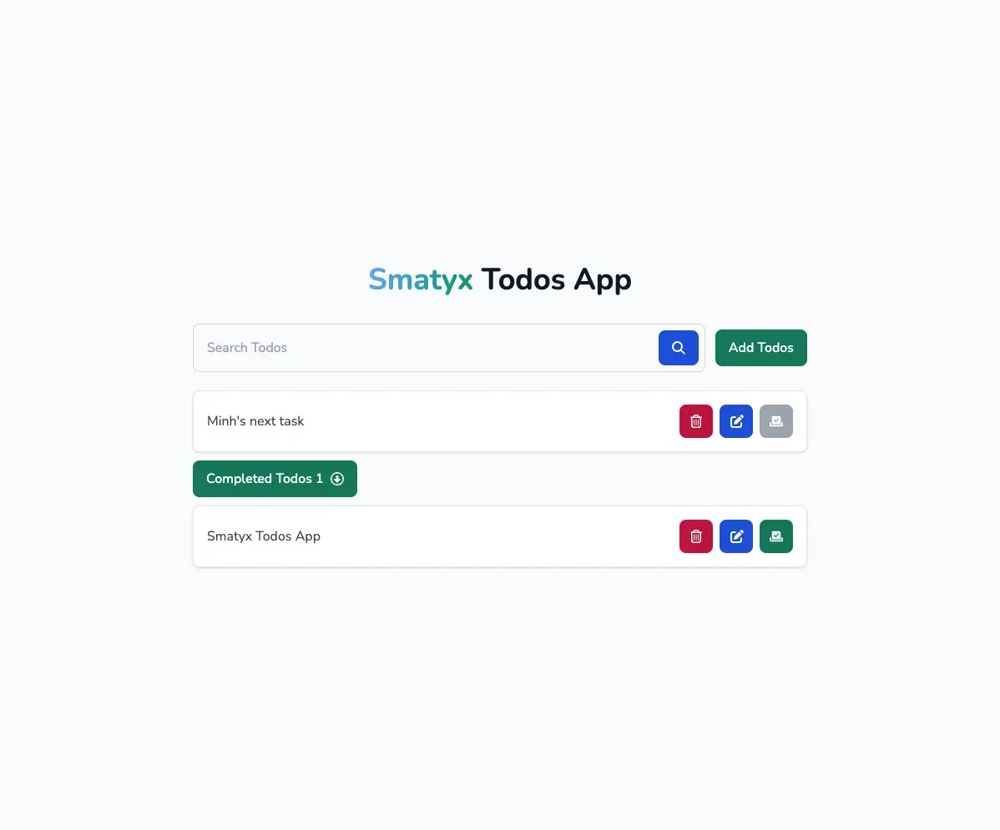

# Smatyx Todos



- Welcome to the React To-Do App with Tailwind CSS! This is a simple web application where you can manage your to-do list. The app is built using React for the front-end and Tailwind CSS for styling.
- Live demo: https://smatyx-todos.vercel.app/
- Please give this source a star, thank you so much 🥰.

## Installation

To run this project locally, follow these steps:

1. Clone the repository or download the source code.
2. Navigate to the project directory.
3. Install the dependencies using yarn:

```shell
yarn install
```

## Usage

To start the development server, use the following command:

```shell
yarn start
```

This will start the development server and open the project in your default browser at `http://localhost:3000`.
